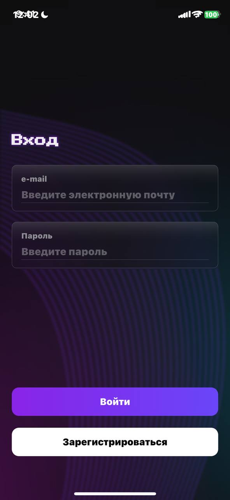
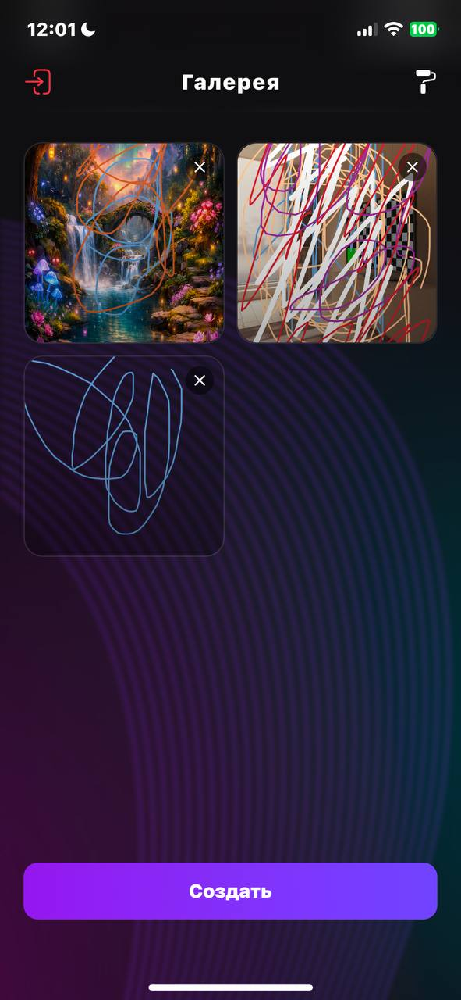
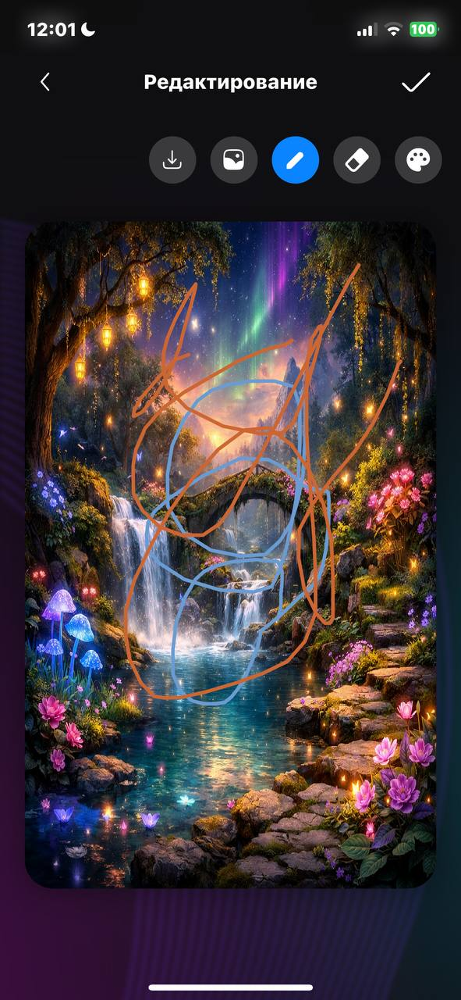

# Aezakmi Test Task

Мобильное iOS-приложение для рисования с облачной синхронизацией. Приложение реализует полный цикл работы художника: от безопасной авторизации до создания, редактирования и сохранения рисунков в облако и галерею устройства.

Приложение выполнено в строгом соответствии с макетами Figma, с использованием нативных iOS-компонентов (**Cupertino**) и архитектуры **Clean Architecture**.

---

## ✨ Ключевые возможности

### 🔐 Авторизация и Безопасность
- [x] **Firebase Auth:** Вход и регистрация через Email/Password.
- [x] **Валидация:** Проверка email (Regex) и пароля в реальном времени.
- [x] **Обработка ошибок:** Удобные диалоговые окна при ошибках сети или неверных данных.
- [x] **Сохранение сессии:** Пользователь остается в системе после перезапуска.

### 🖼 Галерея работ
- [x] **Синхронизация:** Отображение работ пользователя из **Firebase Firestore**.
- [x] **Glassmorphism:** Кастомный AppBar с эффектом матового стекла (Blur + Gradient) как в iOS.
- [x] **Редактирование:** Возможность открыть существующий рисунок и продолжить рисование.
- [x] **Кэширование:** Оптимизированная загрузка изображений.

### 🎨 Графический редактор (Painter)
- [x] **Холст:** Высокопроизводительное рисование с использованием `CustomPainter`.
- [x] **Инструменты:**
    - ✏️ Кисть (настраиваемая толщина).
    - 🧼 Ластик.
    - 🖼 Импорт фото из галереи (рисование поверх фото).
- [x] **Custom Color Picker:** Уникальная реализация градиентной палитры (HSV) с курсором, полностью соответствующая дизайну.
- [x] **Экспорт и Сохранение:**
    - **Share:** Нативный системный попап для отправки (`share_plus`).
    - **Local:** Сохранение в галерею устройства (`gal`).
    - **Cloud:** Загрузка оригинала в **Firebase Storage** и метаданных в **Firestore**.
- [x] **Уведомления:** Локальные пуш-уведомления при успешном сохранении.

---

### Инструкция по запуску
1. [x] Настройка Firebase
Для работы приложения обязательно добавьте конфигурационные файлы:
Скачайте GoogleService-Info.plist (iOS) -> положите в ios/Runner/.
Скачайте google-services.json (Android) -> положите в android/app/.
2. [x] Запуск скрипта установки
В корне проекта находится скрипт setup.sh. Он автоматически очистит проект, установит зависимости и сгенерирует код для MobX.
Откройте терминал в папке проекта и выполните:

### 🛠 Технологический стек

| Категория | Технология |
|-----------|------------|
| **Language** | Dart 3.x |
| **Framework** | Flutter (iOS Focus) |
| **State Management** | **MobX** (`mobx`, `flutter_mobx`, `mobx_codegen`) |
| **DI** | **GetIt** (Service Locator) |
| **Backend** | Firebase (Auth, Firestore, Storage) |
| **UI Kit** | Cupertino (Native iOS Widgets) |

### Основные библиотеки
*   `gal` — Современное сохранение в галерею (Android 10+ / iOS 14+).
*   `share_plus` — Кроссплатформенный шеринг файлов.
*   `flutter_local_notifications` — Системные уведомления.
*   `image_picker` — Выбор изображений.
*   `google_fonts` — Кастомная типографика (Press Start 2P).

---

## 🏗 Архитектура проекта

Проект структурирован по принципам **Clean Architecture** с разделением по фичам (Feature-First):

```text
lib/
├── core/                   # Ядро (DI, Сервисы, Тема, Общие виджеты)
│   ├── di/                 # Настройка GetIt
│   ├── services/           # NotificationService
│   └── widgets/            # IosTextField, Buttons
│
├── data/                   # Слой данных
│   └── repositories/       # Реализация Firebase Auth и т.д.
│
├── domain/                 # Слой бизнес-логики
│   └── repositories/       # Абстрактные интерфейсы
│
├── features/               # Модули приложения
│   ├── auth/               # Экраны входа/регистрации + Stores
│   ├── gallery/            # Экран галереи + Store
│   └── painter/            # Экран рисования, Canvas, Export Logic
│       ├── screens/
│       ├── store/          # PainterStore, PainterExportStore
│       └── widgets/        # DrawingCanvas, ColorPickerPopup
│
└── main.dart               # Точка входа
```

## 📱 Screenshots

| Login | Register | Gallery | Painting |
|:---:|:---:|:---:|:---:|
|  |  |  |  
